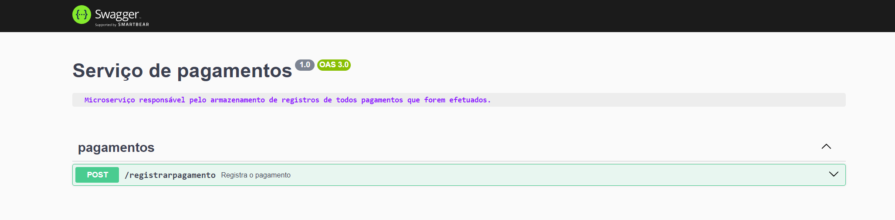

# Microservice de Pagamentos

Microserviço responsável pelo armazenamento de registros de todos pagamentos que forem efetuados.
O microserviço possui um banco de dados próprio, independente do serviço principal da aplicação.

## Entidades
### Pagamento

| Atributo      | Descrição                             | Tipo  |
| ------------- | ------------------------------------- | ----- |
| codigo        | Identificador único do pagamento      | UUID  |
| codAssinatura | Código da assinatura paga             | UUID  |
| valorPago     | Valor pago                            | Int |
| dataPagamento | Data em que o pagamento foi efetivado | Date  |

## Rotas

<div align="center" >
  
</div>
<br>

### Pagamentos

- **POST** `/registrarpagamento`
  - **Descrição**: Cria um registro de pagamento
  - **Dados necessários**:
    - **Body**:
      ```json
      {
        "codAssinatura": "string",
        "valorPago": "number"
      }
      ```

## Instalação

1. Instale as dependências

```bash
npm install
```

2. Rodar o container docker
```bash
docker compose up -d
```

3. Copiar o arquivo com os dados de conexão e demais variáveis ambiente

```bash
cp .env.example .env
```

4. Criar as tabelas do banco de dados (em desenvolvimento)

```bash
npx prisma migrate dev
```

5. Executando o projeto
```bash
npm run start:dev
```

6. Populando o banco de dados

```bash
npx prisma db seed
```

7. Visualizando o banco de dados

```bash
npx prisma studio
```

8. Visualizando a documentação do projeto

```bash
http://localhost:3002/docs
```

<!-- Testes

```bash
npm run test
``` -->

**O servidor será iniciado na porta 3002**
**OBS: O serviço principal deve estar rodando de maneira conjuta com o microserviço para que funcione corretamente**


### 📘 Ferramentas Utilizadas para Construção da Aplicação

## Tecnologias Principais

- [NestJS](https://nestjs.com/)
- [TypeScript](https://www.typescriptlang.org/)
- [PrismaORM](https://www.prisma.io/)
- [Docker](https://www.docker.com/)
- [PostgreSQL](https://hub.docker.com/r/bitnami/postgresql)
- [Zod](https://zod.dev/)
- [FakerJS](https://fakerjs.dev/)

## Módulos do NestJS

- [@nestjs/Swagger](https://docs.nestjs.com/openapi/introduction)
- [@nestjs/config](https://docs.nestjs.com/techniques/configuration)